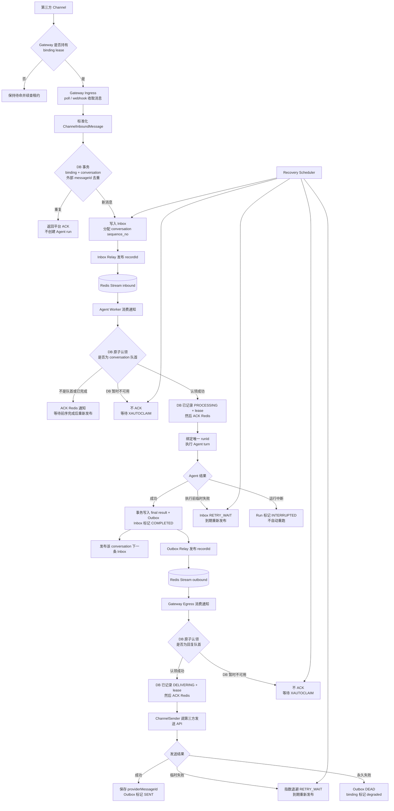
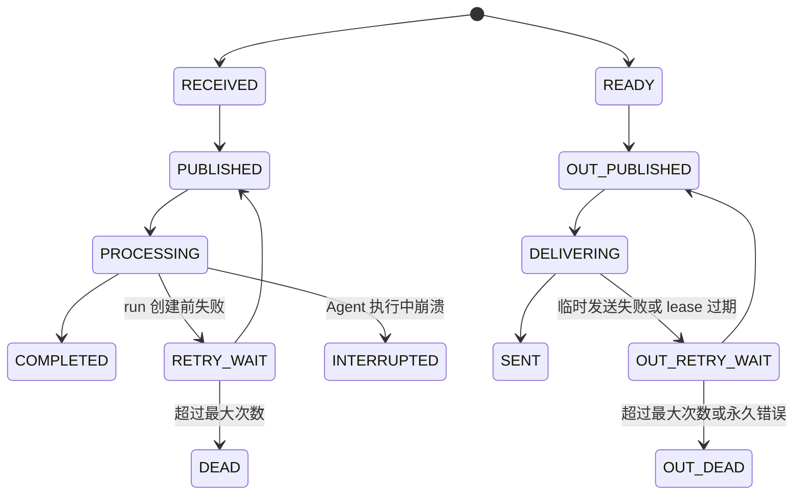

# OpenAgent Java V11 计划：分布式 Channel Runtime

- 版本：V11 方案稿
- 日期：2026-07-22
- 前置版本：V10 微信渠道与 per-chatter 会话/记忆隔离
- 核心目标：Channel 收发与 Agent 执行解耦，支持 PostgreSQL + Redis 多 Pod 部署

## 1. 设计原则

1. PostgreSQL 是 inbox、run 和 outbox 的事实来源；Redis Stream 只负责唤醒和任务分发。
2. 同一外部消息最多创建一个 `agent_run`。
3. 同一 conversation 的 Agent turn 和回复均按 `sequence_no` 严格有序。
4. 出站失败只重试发送，不重新执行 Agent。
5. Agent 运行中断后标记 `INTERRUPTED`，默认不自动重跑可能产生外部副作用的工具。
6. Redis ACK 表示任务所有权已经安全转移到数据库状态，不表示整个业务已经完成。
7. `local` 模式保持 V10 单机行为；`redis` 模式必须使用 PostgreSQL。
8. 不为每条消息动态创建 Kubernetes Pod。Gateway 和 Worker 都是长期运行、可水平扩容的 Deployment。

## 2. 消息传递总流程



## 3. Redis ACK 边界

### 3.1 Inbound

Worker 收到 Redis 通知后先读取并认领 DB inbox：

- DB 不可用：不 ACK，消息留在 PEL，由其他 consumer 回收。
- inbox 已终态：ACK，重复通知无副作用。
- 不是 conversation 队首：ACK 当前通知；前序完成时由 DB relay 再发布。
- 认领成功：事务提交 `PROCESSING + claimed_by + claim_expires_at` 后 ACK。

Worker 在 ACK 后崩溃时，Recovery Scheduler 根据过期 DB claim 恢复，因此可靠性不依赖 Redis pending 是否仍存在。

### 3.2 Outbound

Egress 同样先把 outbox 原子转换为 `DELIVERING`，事务提交后再 ACK Redis。发送失败或进程崩溃由 DB lease 和 retry 状态恢复。

第三方 API 已成功但 `SENT` 状态落库前崩溃时：

- 平台支持 idempotency key：使用 `outbound_id` 消除重复。
- 平台不支持：只能做到 at-least-once，审计中记录潜在重复。

## 4. 数据状态机



## 5. 组件拆分

### 5.1 Channel 接入

- `ChannelReceiver`：长轮询或 webhook 入站，不承担 Agent 执行。
- `ChannelSender`：按 binding 凭据发送消息，不要求当前 Pod 持有入站连接。
- `ChannelIngressService`：标准化、DB 去重、写 inbox。
- `ChannelOutboundWorker`：认领 outbox、发送、重试。

### 5.2 消息与协调

- `ChannelMessageBus`：发布 inbound/outbound record ID。
- `LocalChannelMessageBus`：单机兼容实现。
- `RedisChannelMessageBus`：Redis Streams consumer group 实现。
- `ChannelLeaseService`：binding 级长轮询租约。
- `ChannelRecoveryScheduler`：恢复未发布记录、过期 claim 和 Redis pending。

### 5.3 Agent 执行

- `ChannelAgentWorker`：消费 inbound、执行 head-of-line claim、调用 `AgentRunCoordinator`。
- `AgentRunCoordinator`：保留单 JVM FIFO 作为本地保护，但分布式顺序以 DB inbox 为准。
- `ChannelRunCompletionService`：持久化 final result、创建 outbox、推进下一条 conversation 消息。

## 6. 数据库迁移

新增 `V9__distributed_channel_runtime.sql`：

1. 扩展 `channel_conversations`，增加 `next_sequence`。
2. 扩展 `channel_inbound_messages`，增加内部 ID、序号、payload、状态、claim、重试和错误字段。
3. 新建 `channel_outbound_messages`，唯一约束至少包含 `(run_id, sequence_no)`。
4. 为 inbox/outbox 的 `(status, available_at)`、conversation head-of-line 和过期 claim 建索引。
5. 为 `agent_runs` 增加可恢复的 final result，供 completion/outbox 对账。

## 7. 分阶段实施

1. **M1 本地边界重构**：拆分 receiver、sender、ingress、agent worker、egress；仍使用 local bus。
2. **M2 Inbox/Outbox**：迁移、repository、状态机、单机恢复测试。
3. **M3 Redis 基础设施**：Redis bus、consumer group、lease、Lua 安全续租/释放。
4. **M4 分布式 FIFO**：conversation sequence、head-of-line claim、run 唯一绑定。
5. **M5 可靠出站**：outbox relay、重试、degraded/DEAD、provider message ID。
6. **M6 恢复与可观测性**：expired claim、`XAUTOCLAIM`、backlog/retry/dead/lease 指标。
7. **M7 部署**：同一镜像按角色启动 Gateway 与 Worker Deployment，增加 HPA/PDB/探针。
8. **M8 故障验收**：PostgreSQL + Redis Testcontainers、多实例和 kill/restart 场景。

## 8. 运行角色

默认单机：

```text
api,channel-ingress,agent-worker,channel-egress
```

多 Pod：

```text
Gateway Deployment: api,channel-ingress,channel-egress
Worker Deployment:  agent-worker
```

V11 只把第三方 channel turn 送入分布式 worker。Web SSE 跨 Pod 事件回放可在后续版本独立处理，避免扩大首期范围。

## 9. 验收条件

- 两个 Gateway 中只有 lease holder 执行微信长轮询。
- lease holder 被杀后，备用 Gateway 在 TTL 内接管。
- 同一外部 message ID 在并发重投时只创建一个 run。
- 两个 Worker 消费同一 conversation 时仍严格 FIFO。
- Redis 停机期间已写 DB 的消息在恢复后继续执行。
- Worker 在 ACK 后崩溃，过期 claim 能被恢复。
- Agent 完成后 Gateway 崩溃，不重新执行 Agent，outbox 继续发送。
- 发送失败进入退避和 DEAD 状态，并可观测、可人工重放。
- `local` 模式无需 Redis，V10 全部回归测试保持通过。

